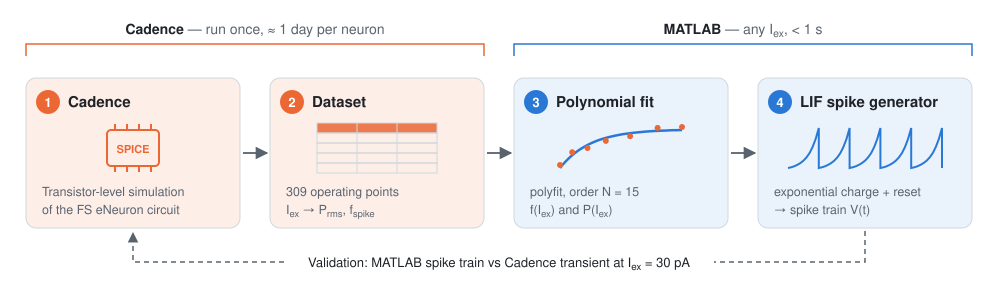
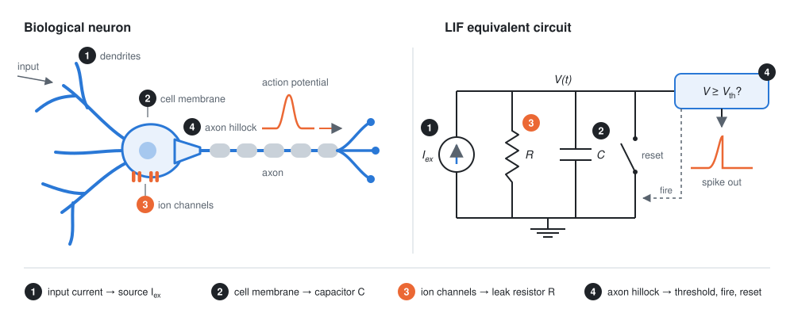
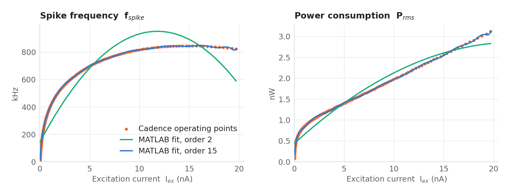
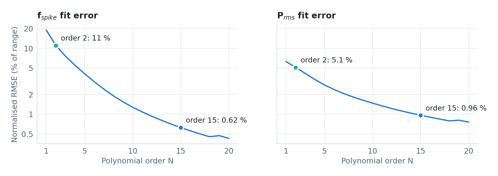
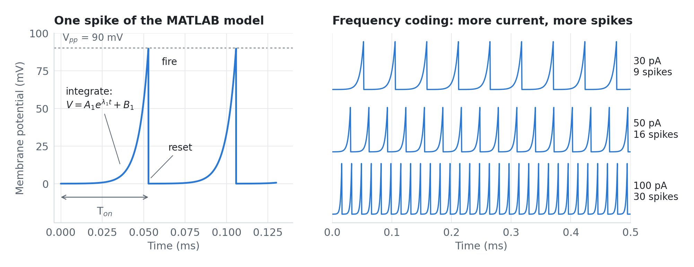
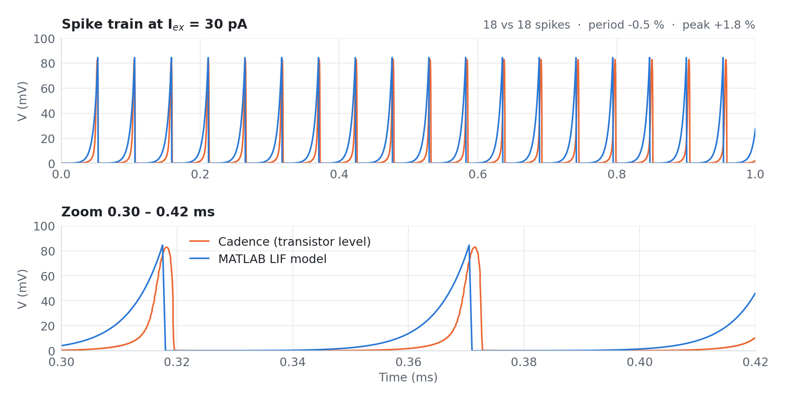

<div align="center">

# Modelling an Artificial Neuron in MATLAB

**A fast Leaky Integrate-and-Fire (LIF) model of a neuromorphic circuit, calibrated on Cadence simulations**

Research internship · [GeePs laboratory](https://www.geeps.centralesupelec.fr/) (CNRS · CentraleSupélec · Université Paris-Saclay · Sorbonne Université) · 2021–2022

**Edouard David · Marc Zhan** — supervised by **Aziz Benlarbi-Delaï** and **Pietro M. Ferreira**


[-555)](docs/Rapport_Neurone_Artificiel_David_Zhan.pdf)

</div>

<p align="center">
  <picture>
    <source media="(prefers-color-scheme: dark)" srcset="docs/figures/pipeline-dark.svg">
    
  </picture>
</p>

Simulating one analog spiking neuron at transistor level in **Cadence** takes about **a day**. That is fine for one neuron, but far too slow to explore networks of them. During this internship we built a **MATLAB behavioural model** of the GeePs *FS eNeuron* circuit: it learns how the neuron's spike frequency and power depend on its input current from Cadence data, then generates the corresponding spike train in **under a second**.

| | Result |
|---|---|
| Simulation time | ≈ 1 day in Cadence → **< 1 s** for the whole MATLAB script |
| Spike-frequency model $f_{spike}(I_{ex})$ | **0.6 %** normalised RMSE over 17.6 pA – 19.7 nA (309 points) |
| Power model $P_{rms}(I_{ex})$ | **1.0 %** normalised RMSE |
| Spike train at $I_{ex}$ = 30 pA | **18 / 18 spikes**, period within **0.5 %**, peak within **1.8 %** of Cadence |

## Contents

1. [Why model a neuron?](#1-why-model-a-neuron)
2. [From biological neuron to electronic circuit](#2-from-biological-neuron-to-electronic-circuit)
3. [Method](#3-method)
4. [Results: MATLAB vs Cadence](#4-results-matlab-vs-cadence)
5. [Repository layout](#5-repository-layout)
6. [How to run](#6-how-to-run)
7. [Limitations and next steps](#7-limitations-and-next-steps)
8. [Authors, acknowledgements and references](#8-authors-acknowledgements-and-references)

## 1. Why model a neuron?

Connected objects (IoT) send their measurements to the cloud and wait for instructions back. Most of their energy goes into staying connected, not into computing. One way out is to process information **locally, with circuits that work like the brain**: the brain analyses complex scenes in real time on about 20 W, because its neurons encode information in the **frequency** of identical electrical pulses (spikes) rather than in continuous signals.

The electronics team at GeePs designs such **neuromorphic circuits**: analog "eNeurons" that turn an input current into a spike train. Designing them requires transistor-level simulation in Cadence, which is accurate but slow. Our task was to build a **fast model in MATLAB** that reproduces what Cadence computes, so the researchers can study circuits with many neurons.

## 2. From biological neuron to electronic circuit

<p align="center">
  <picture>
    <source media="(prefers-color-scheme: dark)" srcset="docs/figures/neuron_to_circuit-dark.svg">
    
  </picture>
</p>

A neuron receives current through its **dendrites** ①. Its **membrane** ② is a thin insulating lipid layer, so it stores charge like a **capacitor**, while **ion channels** ③ (Na⁺, K⁺, Cl⁻) let some of that charge leak away like a **resistor**. At rest the membrane sits around −60 mV. When the accumulated potential crosses a threshold at the **axon hillock** ④, the neuron fires an **action potential** that travels down the axon, then resets.

Every spike has the same amplitude: the information is carried by **how often** the neuron fires (frequency coding). A stronger input makes the membrane reach the threshold sooner, so the neuron fires faster.

This is exactly the **Leaky Integrate-and-Fire** model:

```math
C\,\frac{dV}{dt} \;=\; I_{ex} \;-\; \frac{V - V_{rest}}{R}, \qquad V \ge V_{th} \;\Rightarrow\; \text{spike, then } V \leftarrow V_{rest}
```

### Why LIF?

Neuron models trade biological realism against mathematical complexity:

| Model | Biological realism | Complexity | In one line |
|---|---|---|---|
| McCulloch–Pitts | low | very low | binary threshold unit, no dynamics |
| **Leaky Integrate-and-Fire** | **medium** | **low** | **RC membrane + threshold and reset (our model)** |
| Izhikevich | high | medium | two coupled ODEs, many firing patterns |
| Hodgkin–Huxley (1952) | very high | high | four coupled non-linear ODEs for the Na⁺, K⁺ and leak currents |

Hodgkin–Huxley describes the ion currents in detail,

```math
C_M\,\frac{dV}{dt} = I - \bar g_K\, n^4 (V - V_K) - \bar g_{Na}\, m^3 h\,(V - V_{Na}) - \bar g_l\,(V - V_l),
```

but its gating variables $n, m, h$ each follow their own non-linear equation. LIF keeps the essential behaviour (integrate, leak, fire, reset) with a single capacitor, which makes it the standard compromise for circuit design, and the model we were asked to simulate.

## 3. Method

The model has two blocks: an **interpolation block** that turns the input current $I_{ex}$ into a spike frequency $f_{spike}$ and a power $P_{rms}$, and a **LIF block** that turns $f_{spike}$ into a spike train $V(t)$.

### 3.1 Cadence data

The GeePs team simulated the fast-spiking (FS) eNeuron at transistor level ([Ferreira et al., 2021](https://doi.org/10.1007/s10470-020-01729-3)) and exported:

- **309 operating points** from 17.6 pA to 19.7 nA, each with the RMS power $P_{rms}$ and the spike frequency $f_{spike}$ ([`data/TB_Ferreira2020_FS_MLneuron_PLS_FoM.csv`](data/TB_Ferreira2020_FS_MLneuron_PLS_FoM.csv));
- **one transient simulation** of the output voltage at $I_{ex}$ = 30 pA over 1 ms ([`data/Vout_LIF_30p.csv`](data/Vout_LIF_30p.csv)).

### 3.2 Polynomial fit of $f_{spike}(I_{ex})$ and $P_{rms}(I_{ex})$

We fit both curves with MATLAB's `polyfit`, which finds the polynomial of order $N$ that minimises the squared error to the Cadence points:

```math
S = \sum_{i=1}^{309} \big[\,y_i - f(x_i)\,\big]^2
```

A quadratic is far too stiff: it misses the fast rise at low current and bends down at high current. Raising the order steadily reduces the error:

<p align="center">
  <picture>
    <source media="(prefers-color-scheme: dark)" srcset="docs/figures/fits-dark.png">
    
  </picture>
</p>

<p align="center">
  <picture>
    <source media="(prefers-color-scheme: dark)" srcset="docs/figures/error_vs_order-dark.png">
    
  </picture>
</p>

We kept **order 15**: the error is below 1 % of the full range for both quantities, and higher orders bring little gain while the fit becomes numerically ill-conditioned (MATLAB fails to fit at order 30).

### 3.3 LIF spike generator

`LIF.m` builds the spike train period by period. During the charge phase the membrane potential grows exponentially until it reaches the spike amplitude $V_{pp}$, then it resets:

```math
V(t) = A_1\, e^{\lambda_1 t} + B_1 \quad (0 \le t \le T_{on}), \qquad
\lambda_1 = \frac{\ln\!\left(1 + V_{pp}/A_1\right)}{T_{on}}, \qquad B_1 = -A_1
```

$B_1 = -A_1$ makes each spike start at 0 mV, and $\lambda_1$ is chosen so that it reaches exactly $V_{pp}$ at $T_{on}$. The duration $T_{on} = DC \cdot T$ comes from the period $T \propto 1/f_{spike}$ given by the fit, and $A_1$ sets how sharp the exponential is. We use $DC = 0.5$, $V_{pp}$ = 90 mV and $A_1$ = 0.01.

<p align="center">
  <picture>
    <source media="(prefers-color-scheme: dark)" srcset="docs/figures/spike_model-dark.png">
    
  </picture>
</p>

> **Debugging note.** Our first versions shifted the spike window by updating `Ton = Ton + T` (spike amplitude shrank over time) or `T = T + T` (the period doubled at every spike). The fix was to keep `Ton` and `T` fixed and move the time origin of the window (`x`, `y`, `z` in `LIF.m`) forward after each spike.

## 4. Results: MATLAB vs Cadence

We overlaid the MATLAB spike train on the Cadence transient for the same input current, 30 pA:

<p align="center">
  <picture>
    <source media="(prefers-color-scheme: dark)" srcset="docs/figures/validation_30pA-dark.png">
    
  </picture>
</p>

- **Same number of spikes** in 1 ms (18 vs 18) and the **same rhythm**: mean period 53.0 µs vs 53.3 µs (−0.5 %).
- **Same amplitude**: peaks of 84.4 mV vs 82.9 mV (+1.8 %).
- **Shape**: the Cadence spike rises later and more abruptly than our exponential, so individual samples differ even though the timing matches.

The whole MATLAB script (loading data, both fits, three spike trains) runs in **well under a second** (0.2 s in our test, plots excluded), compared with about a day for one Cadence transient. MATLAB can therefore stand in for Cadence when exploring the frequency and power behaviour of many neurons.

## 5. Repository layout

```text
.
├── matlab/
│   ├── main.m        # full pipeline: load data, fit, errors, spike trains, comparison
│   ├── LIF.m         # spike-train generator  [Vtemps, V] = LIF(DC, Fe, Fsp, Vpp)
│   └── FS.m          # same generator, also returns λ1, λ2 and T
├── data/
│   ├── TB_Ferreira2020_FS_MLneuron_PLS_FoM.csv   # 309 Cadence points: Iex (A), Prms (W), fspike (Hz)
│   ├── Vout_LIF_30p.csv                           # Cadence transient at 30 pA: time (s), Vout (V)
│   └── suite1.csv                                 # raw export of the same sweep (French locale)
├── scripts/
│   ├── make_figures.py   # regenerates every figure in docs/figures and prints the metrics above
│   └── requirements.txt
└── docs/
    ├── Rapport_Neurone_Artificiel_David_Zhan.pdf  # full internship report (French)
    └── figures/
```

## 6. How to run

**MATLAB model.** Open `matlab/main.m` and run it (any working folder: data paths are resolved from the script's location). It needs the Control System Toolbox for the `tf` / `impulse` plots of the input current. It prints the fit errors and opens:

| Figure | Content |
|---|---|
| 1, 2 | $P_{rms}(I_{ex})$ and $f_{spike}(I_{ex})$: fit vs Cadence |
| 7, 8 | spike trains and input current for two excitation levels |
| 9 | MATLAB vs Cadence spike train at 30 pA |

To simulate another current after running `main.m` (which leaves the fit coefficients `P` in the workspace), evaluate the fit and call the generator:

```matlab
Iex_nA = 0.05;                              % 50 pA, in the fit's nA units
Fsp    = polyval(P, Iex_nA) * 1e3;          % spike frequency (Hz)
[t, V] = LIF(0.5, 2000, Fsp, 90);           % DC, samples per ms, Fsp, Vpp (mV)
plot(t, V), xlabel('Time (ms)'), ylabel('Membrane potential (mV)')
```

**Figures.** The figures in this README are generated from the CSV files by a Python port of `LIF.m` and of the fitting code:

```bash
pip install -r scripts/requirements.txt
python scripts/make_figures.py
```

## 7. Limitations and next steps

- **Very low currents.** A polynomial in $I_{ex}$ spans three decades of current poorly. Below about 50 pA the fit overestimates the frequency (15 kHz instead of 1 kHz at 18 pA). Fitting against $\log I_{ex}$ instead cuts the error about 7×: an order-8 polynomial reaches 0.08 % ($f_{spike}$) and 0.13 % ($P_{rms}$) normalised RMSE.
- **One calibration point.** `LIF.m` scales the period with an empirical constant (3.40) matched to the 30 pA transient. Comparing with Cadence transients at other currents is the natural next step.
- **Spike shape.** A two-stage exponential, or the decaying branch ($A_2$, $\lambda_2$) already present in `LIF.m`, could reproduce the sharper Cadence spike.
- **Networks.** The original goal: connect many modelled neurons through synapses and study their collective behaviour.

<details>
<summary><b>Reproducibility notes</b> (how these numbers relate to the report)</summary>

<br>

- The **RMSE** values in the report's error table (Fig. 12) are reproduced exactly by `scripts/make_figures.py` (e.g. order 1: 0.1599 MHz for $f_{spike}$ and 0.1907 nW for $P_{rms}$).
- The report's **RMSPE** columns come from `main.m`, which computes $\sqrt{\text{mean}(\Delta X^2)}$ for $f_{spike}$ and $\sqrt{100\cdot\text{mean}(\Delta X^2)}$ for $P_{rms}$. Neither is a percentage. Computed as $100\cdot\sqrt{\text{mean}(\Delta X^2)}$, the order-15 relative errors are 220 % and 25 %, dominated by the few points below 50 pA where the true values are tiny. This README therefore reports the RMSE normalised by the data range, together with the median relative error (1.0 % for $f_{spike}$, 2.1 % for $P_{rms}$).
- The **9.2 %** quoted in the report for the spike-train comparison is reproduced by the last block of `main.m` (9.21). That block compares the two traces sample by sample although they use different time steps (0.1 µs in Cadence, 0.5 µs in MATLAB) and reuses accumulators from earlier blocks, so the spike count, period and amplitude above describe the agreement more reliably.

</details>

## 8. Authors, acknowledgements and references

**Edouard David** and **Marc Zhan**, 3rd-year Bachelor (L3) in Electronics, Energy and Control, CMI Électronique, Sorbonne Université.

We thank **Aziz Benlarbi-Delaï** and **Pietro M. Ferreira** for their guidance throughout the internship. The Cadence datasets in `data/` were produced by the GeePs electronics team.

The full report (in French) is in [`docs/Rapport_Neurone_Artificiel_David_Zhan.pdf`](docs/Rapport_Neurone_Artificiel_David_Zhan.pdf).

**Key references**

1. P. M. Ferreira et al., "Neuromorphic analog spiking-modulator for audio signal processing," *Analog Integrated Circuits and Signal Processing*, 106(1), 261–276, 2021. [doi:10.1007/s10470-020-01729-3](https://doi.org/10.1007/s10470-020-01729-3)
2. M. Daliri et al., "A comparative study between E-neurons mathematical model and circuit model," *IET Circuits, Devices & Systems*, 2021. [doi:10.1049/cds2.12017](https://doi.org/10.1049/cds2.12017)
3. S. Dutta et al., "Leaky integrate and fire neuron by charge-discharge dynamics in floating-body MOSFET," *Scientific Reports*, 7, 8257, 2017. [doi:10.1038/s41598-017-07418-y](https://doi.org/10.1038/s41598-017-07418-y)
4. A. L. Hodgkin and A. F. Huxley, "A quantitative description of membrane current and its application to conduction and excitation in nerve," *The Journal of Physiology*, 117(4), 500–544, 1952. [doi:10.1113/jphysiol.1952.sp004764](https://doi.org/10.1113/jphysiol.1952.sp004764)
5. C. D. Schuman et al., "A survey of neuromorphic computing and neural networks in hardware," arXiv:1705.06963, 2017. [arxiv.org/abs/1705.06963](https://arxiv.org/abs/1705.06963)

## License

For academic and research use only. Contact the authors for redistribution or commercial use.
